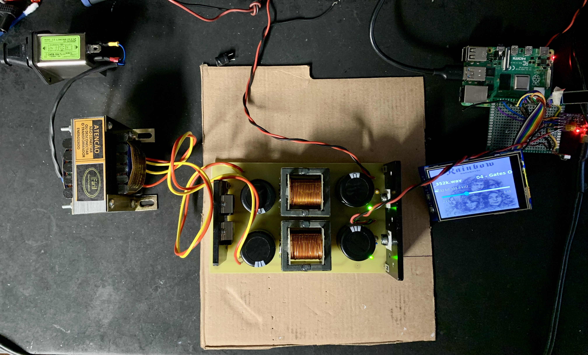
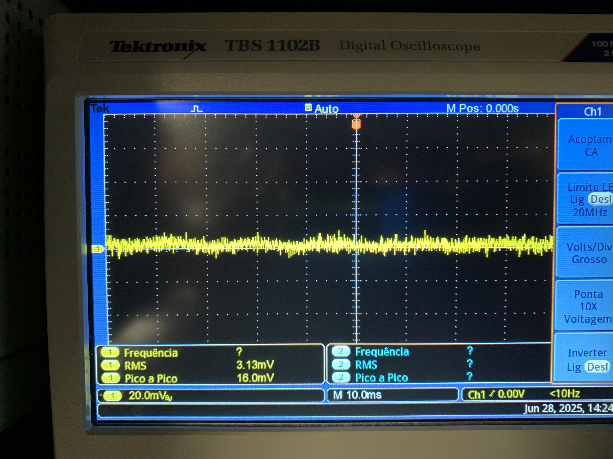

# Linear Power Supply and Filter Implementation

A low-noise linear power stage was implemented to provide a clean 5 V rail for sensitive digital and audio subsystems. The post-rectifier smoothing stage uses a π (CLC) filter and a low-dropout regulator (LDO, LD1085V5) to guarantee line regulation and very low output noise. The filter inductor was hand-wound on an E-core ferrite; all design choices were driven by analytical calculations and verified with bench tests (oscilloscope, spectrum analysis and dynamic load steps). While the theoretical calculations gave initial targets, practical measurements were essential — real-world effects (winding parasitics, core loss, mounting, stray capacitances and the regulator’s output impedance) always shift results. The design process therefore combined first-principles formulas, conservative safety margins and iterations on the bench until the measured ripple was effectively negligible (i.e., below the measurement noise floor of the scope and audio-sensitive circuits). This approach ensures a robust, low-ripple supply tuned for high-sensitivity audio and digital use.

1) Power Supply and PI Filter:
   

2) Ripple on the 5 Volts rail is below the measurement noise floor:
   
